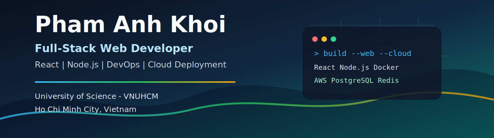

  

  <h1>Hi, I'm Pham Anh Khoi</h1>
  <h3>Full-Stack Web Developer | Frontend Developer & DevOps | IT Student</h3>

  

    Final-year Information Technology student at University of Science - VNUHCM,
    focused on building scalable web applications with React, Node.js, cloud deployment,
    clean developer workflows, and blockchain-backed product flows.
  

  

    
    
    
    
    
  

## Featured Project

### WeeUp - Job Referral Platform

**Frontend Developer & DevOps**

WeeUp is a job search platform with an incentivized candidate referral system.
I worked on the frontend experience and deployment flow while helping integrate
production-oriented backend features.

**Highlights**

- Integrated JWT authentication and Google OAuth.
- Built admin dashboard flows with audit trail support.
- Worked with payment system integration and RESTful APIs.
- Supported API reliability with rate limiting, validation, and structured error handling.
- Deployed backend on Heroku and frontend on AWS S3 + CloudFront with DNS via PA Vietnam.

**Tech Stack**

`TypeScript` `React` `Node.js` `Express.js` `PostgreSQL` `Redis` `Tailwind CSS` `Docker` `AWS`

## More Work

### CrossDaRoad Game

Classic arcade game built in C++ with an emphasis on object-oriented design,
movement logic, collision handling, and source-code structure.

Repository: [github.com/pakhoi1604/CrossDaRoad](https://github.com/pakhoi1604/CrossDaRoad)

### AstroPay - Cardano SEA Hackathon 2026

Second Prize winner for a Zalo Mini App that automates real-estate commission
payouts with smart QR flows, split logic, and blockchain audit logging.

## Current Focus

- Building full-stack web applications with React, Node.js, and PostgreSQL.
- Improving DevOps workflows with Docker, CI/CD, Linux servers, and cloud deployment.
- Learning blockchain application design, smart-contract concepts, and audit-friendly transaction flows.
- Exploring security-minded product development through the Google Cybersecurity certificate.
- Open to collaboration on practical web platforms, automation tools, and cloud-backed products.

## Tech Stack

| Frontend                                                                                                                                                                                                                                                                                                                                                                                                                                                | Backend                                                                                                                                                                                                                                                                                                                                                                                                                    | Databases & Cache                                                                                                                                                                                                |
| ------------------------------------------------------------------------------------------------------------------------------------------------------------------------------------------------------------------------------------------------------------------------------------------------------------------------------------------------------------------------------------------------------------------------------------------------------- | -------------------------------------------------------------------------------------------------------------------------------------------------------------------------------------------------------------------------------------------------------------------------------------------------------------------------------------------------------------------------------------------------------------------------- | ---------------------------------------------------------------------------------------------------------------------------------------------------------------------------------------------------------------- |
|     |     |   |

| DevOps & Cloud                                                                                                                                                                                                                                                                                                                                                                                                    | Tools                                                                                                                                                                                                                                                                                                                                                                                                                 | Security                                                                                                                                             |
| ----------------------------------------------------------------------------------------------------------------------------------------------------------------------------------------------------------------------------------------------------------------------------------------------------------------------------------------------------------------------------------------------------------------- | --------------------------------------------------------------------------------------------------------------------------------------------------------------------------------------------------------------------------------------------------------------------------------------------------------------------------------------------------------------------------------------------------------------------- | ---------------------------------------------------------------------------------------------------------------------------------------------------- |
|     |     |  |

| Blockchain & Web3 |
| --- |
|     |

## GitHub Statistics

  

